# CRACkme

Я написала программу, которая эмулирует проверку пароля, заложив в нее несколько уязвимостей, а затем обменялась программами с [ZaSharipova](https://github.com/ZaSharipova) для перекрестного взлома.

Для понимания работы программы напарника были использованы:
- Turbo debugger для понимания того, как программа работает и дизасма
- IDA, когда turbo debugger не могут корректно дешифровать байты.

## Моя программа
Программа запрашивает пароль от пользователя, сравнивает хэш пароля (используется полиномиальный хэш) с эталонным, при совпадении выводит сообщение в рамочке о том, что пароль верный, иначе - выводит о том, что неверный. Установлена канареечная защита буфера и защита от переполнения (однако в ней есть уязвимости).

## Уязвимости
**Легкая:** Буфер для пароля и буфер с хэшем расположены рядом, а переменная содержащая максимальный размер буфера допускает небольшое переполнение. Так как используется полиномиальный хэш, то достаточно заполнить буфер пароля и буфер хэша нулями.

**Сложная:** Можно переполнить буфер так, чтобы дойти до стека и заменить адрес возврата. В этой уязвимости есть усложнения:
- После буфера для пароля есть код рисования рамки и стоит переписать его для корректной работы программы.
- После буфера с хешем расположена переменная, которая содержит лимит количества вводимых символов. Нужно изменить ее значение, чтобы программа не завершилась с ошибкой, что ввод длинный.
- В конце программы расположен буфер на 10к нулевых байт, а после него канарейка. Если не переписать ее значение, то программа завершится с ошибкой, что ввод длинный.

## Взлом программы напарника

### Программа 1. Поиск первой уязвимости.

Сначала была проведена отладка программы, чтобы определить расположение буфера пароля и проверить наличие защиты от переполнения.

После запуска программа вызывает одну функцию, внутри которой выполняется ввод пароля, его проверка и вывод результата. После завершения функции программа завершается.

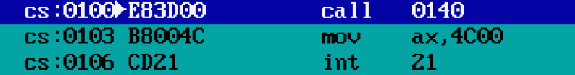

Рассмотрим цикл ввода пароля. Из анализа кода видно, что вводимые данные сохраняются в ds, при этом проверка на переполнение буфера отсутствует.

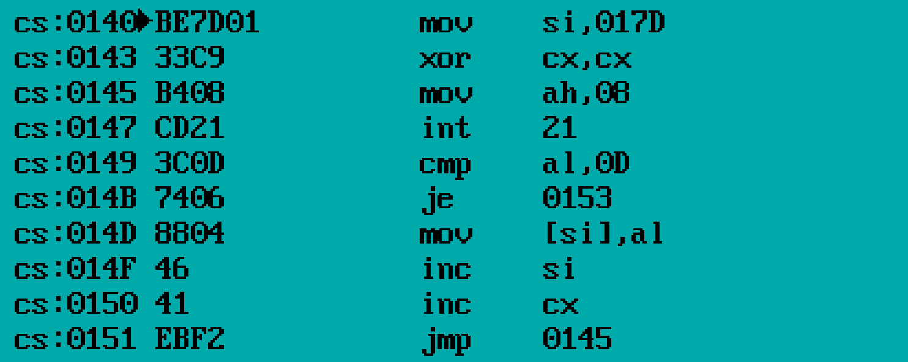

Далее была проанализирована область памяти, расположенная сразу после буфера

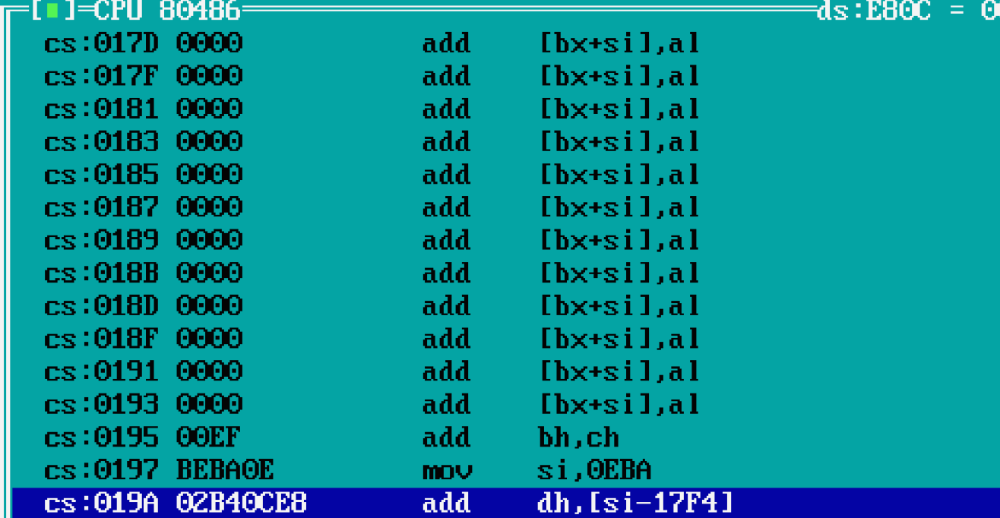
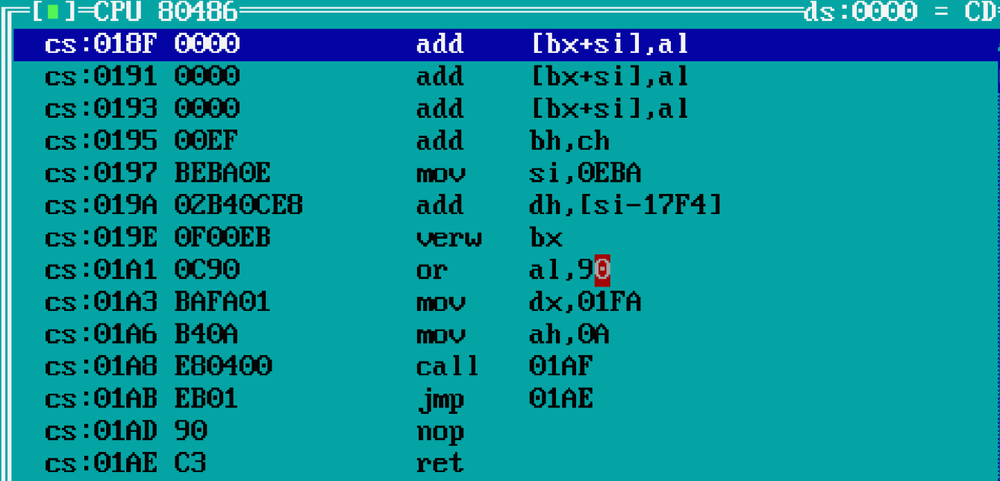

После буффера лежат некоторые данные и код, а затем происходит возврат из функции. Это указывает на возможность того, что непосредственно после буфера расположен исполняемый код.

Для более точного анализа был выполнен дизассемблирование программы в IDA

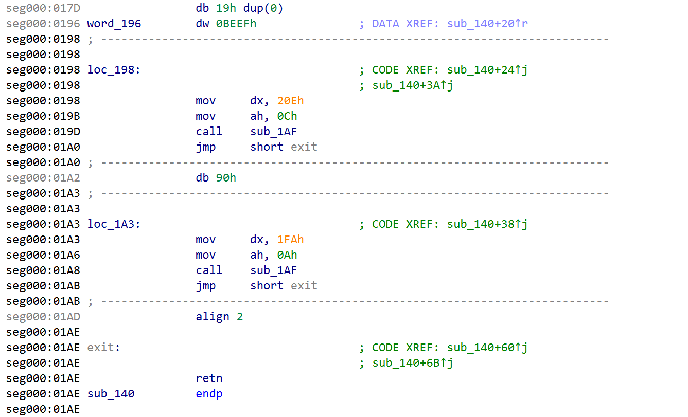

После буфера расположен код, выполняющий передачу параметров и вызов функции вывода. Логика ветвления устроена так, что после выполнения одного из блоков кода происходит переход к возврату из функции. Также сразу после буфера располагается канарейка.

Посмотрим на данные, расположенные по адресам cs:0020E и cs:00FA

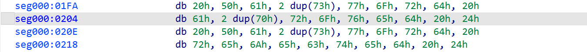

Дешифровав последовательность ASCII кодов, получим, что по адресу cs:0020E расположена строка `Password approved$`, а по адресу cs:00FA - `Password rejected$`. 

Оставалось неясным назначение значений 0Ah и 0Ch, помещаемых в регистр AH. Для этого была проанализирована функция, вызываемая после передачи данных.

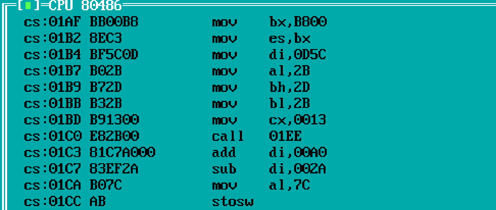

Данная функция работает с видеопамятью и использует инструкцию stosw для вывода символов. В регистр AL передаётся атрибут отображения символа:
- 0Ah = 00001010 - это светло-зеленый текст на черном фоне
- 0Ch = 00001100 - это светло-красный текст на черном фоне.

Сразу после буфера расположен код, который передаёт параметры функции вывода сообщения о неверном пароле, а затем — код, передающий сообщение о корректном пароле. Это позволяет сформировать переполнение буфера таким образом, чтобы даже при неуспешной проверке пароля выполнялся код, выводящий сообщение о корректном пароле.

Для определения соответствия последовательностей байтов инструкциям был использован дизассемблер IDA

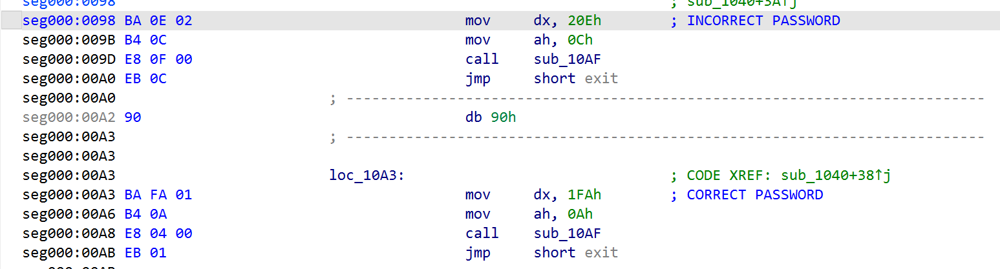

Эксплуатация уязвимости выполняется путём формирования следующей последовательности байтов:
- Первые 25 байт — произвольные данные (заполнение буфера);
- EF BE — значение канарейки;
- BA FA 01 B4 0A - Байты, соответсвующие инструкциям, передающие в функцию вывода данные о том, что пароль верный

Запустим программу:

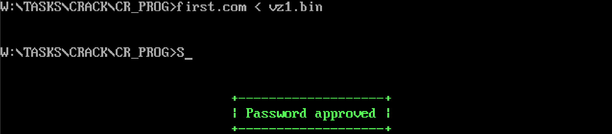

Код, формирующий последовательность байт для эксплуатации данной уязвимости, приведён в файле VZ1.CPP в папке CR_PROG.

### Программа 2. Поиск второй уязвимости.

В предыдущей версии программы присутствовала уязвимость переполнения буфера, поэтому была проведена отладка для определения расположения буфера пароля и проверки наличия защиты от переполнения.

После запуска программа вызывает единственную функцию, внутри которой выполняется ввод пароля, его проверка и вывод результата, после чего происходит завершение программы.

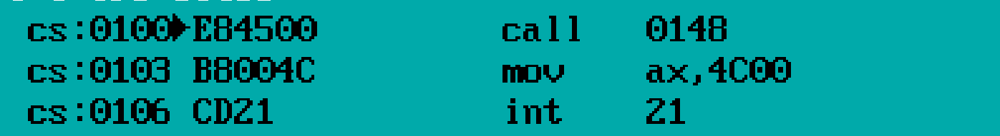

Цикл ввода символов пароля показывает, что вводимые данные сохраняются в стек. В коде также присутствует проверка границ буфера.

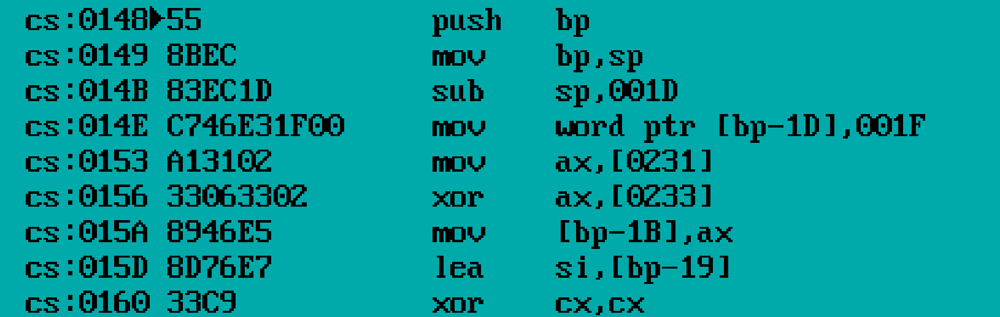
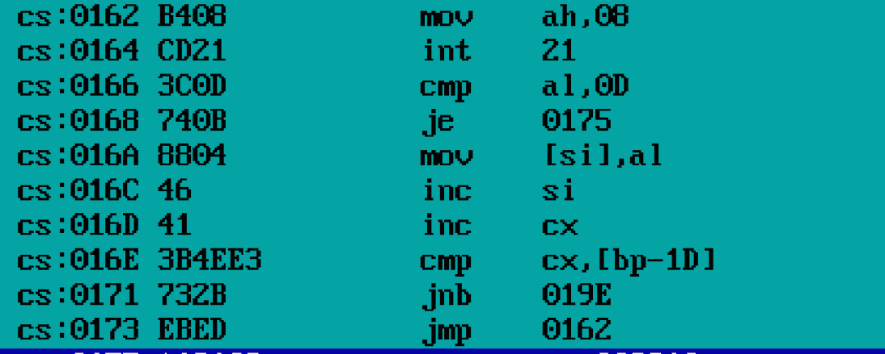

Однако в реализации проверки присутствует ошибка: для буфера выделено 25 байт, тогда как проверка допускает ввод до 31 байта. В результате возможно переполнение буфера и перезапись данных, расположенных далее в стеке.

Это позволяет перезаписать сохранённые значения на стеке, включая адрес возврата, то есть можно попытаться заменить адрес возврата на адрес участка кода, выводящего сообщение о корректном пароле. Однако возникает проблема: программа использует только одну функцию, и после возврата из неё происходит завершение программы.

Поэтому необходимо добавить адреса возврата в стек так, чтобы управление сначала передавалось коду, выводящему сообщение «Password approved», а затем корректно возвращалось к коду завершения программы.

В программе присутствует участок кода, в котором после выполнения одного из блоков происходит переход к эпилогу функции и последующий возврат

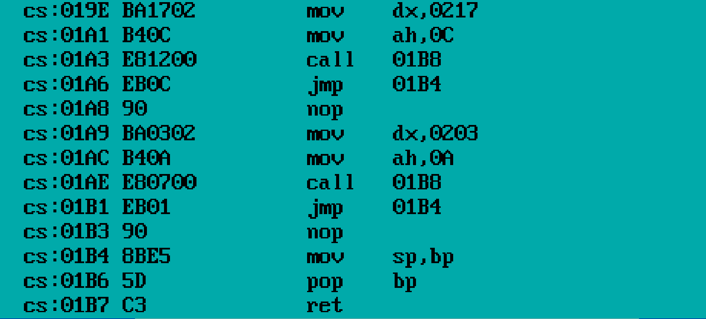

Посмотрим на данные, расположенные по адресам cs:0217 и cs:0203

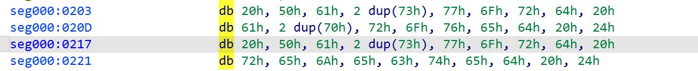

Дешифровав последовательность ASCII кодов, получим, что по адресу cs:0203 расположена строка `Password approved$`, а по адресу cs:0217 - `Password rejected$`. Адрес возврата на код, выводящий, что пароль верный - cs:01A9

Тогда рассмотрим последовательность действий программы после замены адресов возврата в стеке:
- Извлечем из стека bp (pop bp)
- Выполним вывод, что пароль верный
- sp восстановится из bp (mov sp, bp)
Значение bp, извлекаемое на шаге 2, было помещено в стек при входе в основную функцию программы (функцию, выполняющую ввод пароля, его проверку и вывод результата). Если управление передать непосредственно на код вывода успешного сообщения, то после выполнения указанных инструкций sp будет установлен в некорректную позицию стека, и последующая инструкция ret выполнит возврат по неопределённому адресу.

Чтобы сохранить корректную структуру стека, перед адресом перехода на код успешного вывода необходимо дополнительно разместить в стеке значение bp. Оно должно быть равно адресу в стеке, где расположен адрес возврата к коду завершения программы, минус 2 байта (так как при выполнении инструкции pop bp указатель стека увеличивается на 2 байта). Это обеспечивает корректное восстановление sp и последующий возврат программы.

Запустим программу:

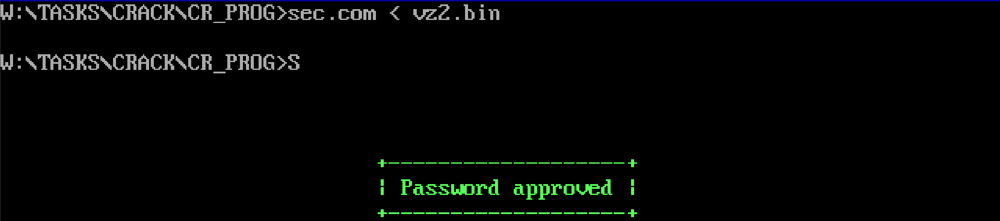

Код, формирующий последовательность байт для эксплуатации данной уязвимости, приведён в файле VZ2.CPP в папке CR_PROG.

## Патчинг

В ходе исследования уязвимостей программы возник вопрос: можно ли изменить её поведение без эксплуатации переполнения буфера. Например, добиться того, чтобы при вводе любого пароля (который не вызывает переполнение) программа всё равно выводила сообщение о корректном пароле.

Это можно сделать, изменив инструкции непосредственно в .com-файле. Рассмотрим программу 1.

Найдем участок, где пароль сравнивается с эталонным:

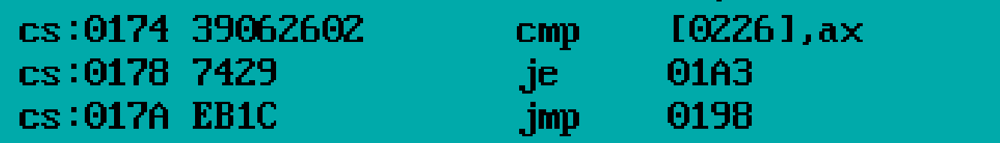

Чтобы программа переходила к ветке «пароль верный» независимо от результата сравнения, можно заменить условный переход (`je 01A3`) на безусловный (`jmp 0198`).

Инструкция `je` кодируется байтом `74`, а `jmp` - `EB`. Так что нам достаточно заменить байт `74` по адресу `cs:0178` на байт `EB`.

Код, производящий замену байт для успешного патчинга, приведён в файле PATCH.CPP в папке CR_PROG.