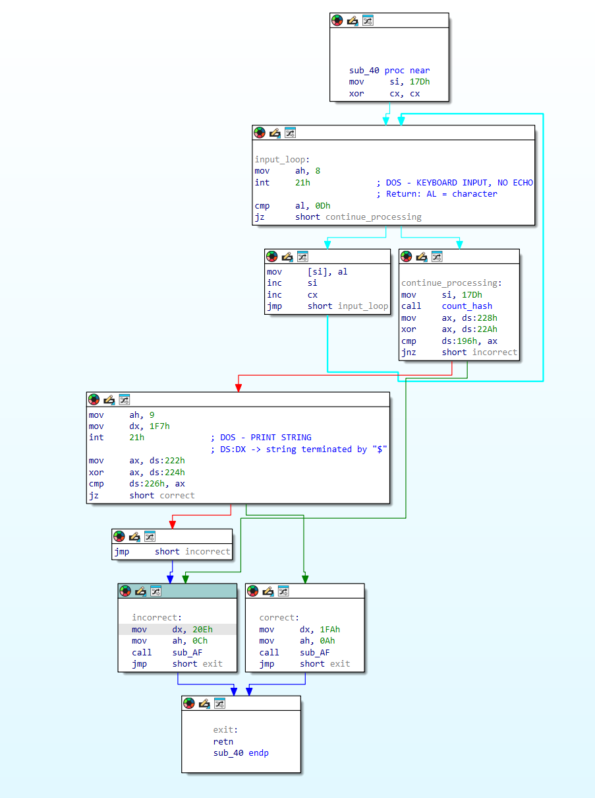
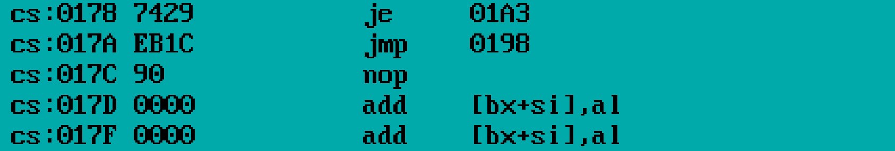
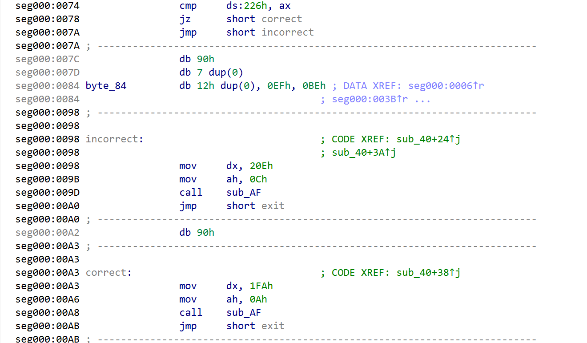
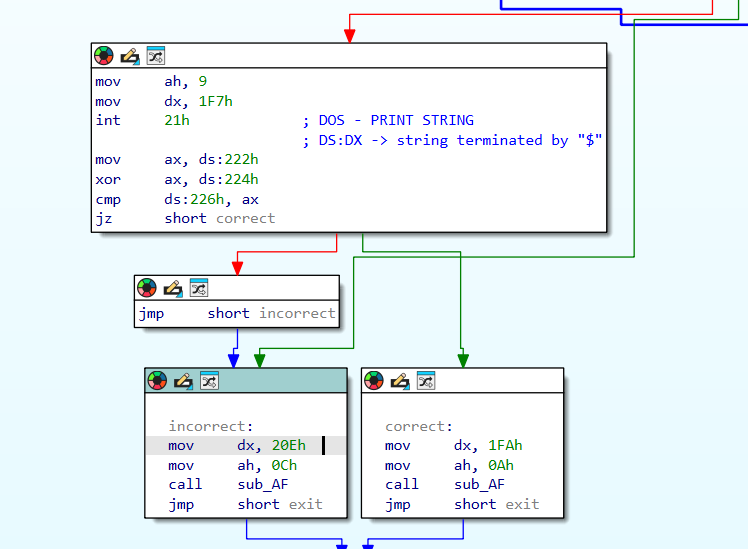
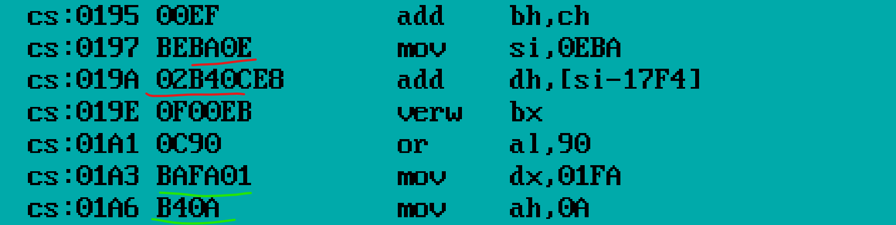
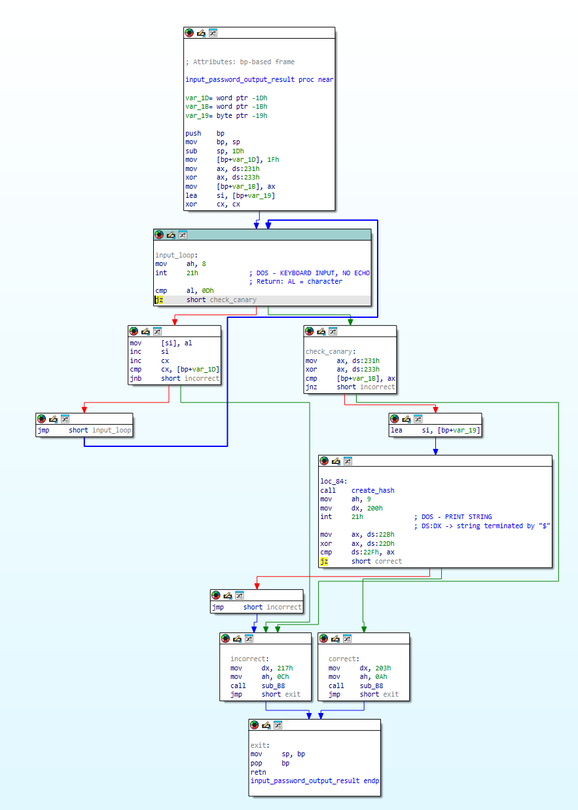
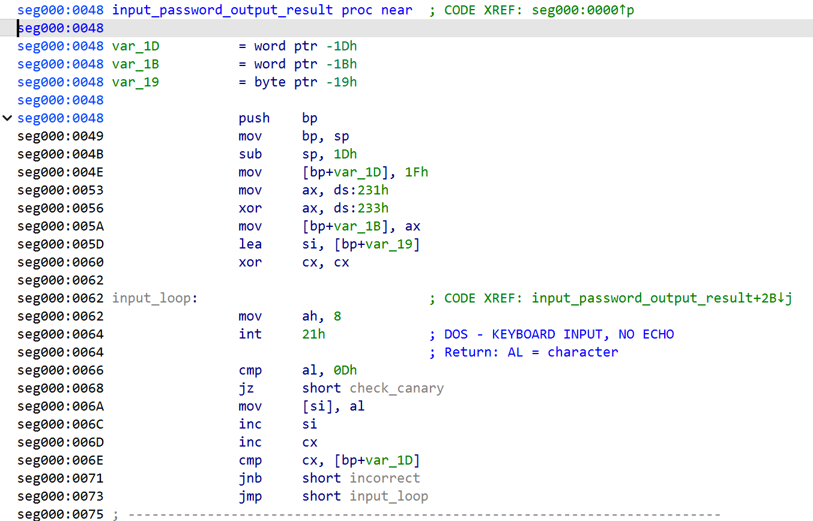
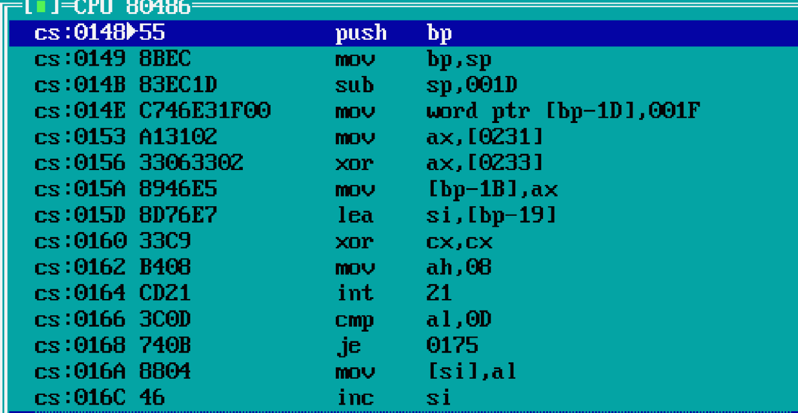

# Взлом ассемблерных программ

## Моя программа
Программа запрашивает пароль от пользователя, сравнивает хэш пароля (используется полиномиальный хэш) с эталонным, при совпадении выводит сообщение в рамочке о том, что пароль верный, иначе - выводит о том, что неверный. Установлена канареечная защита буфера и защита от переполнения (однако в ней есть уязвимости).

## Уязвимости
**Легкая:** Буфер для пароля и буфер с хэшем расположены рядом, а переменная содержащая максимальный размер буфера допускает небольшое переполнение. Так как используется полиномиальный хэш, то достаточно заполнить буфер пароля и буфер хэша нулями.

**Сложная:** Можно переполнить буфер так, чтобы дойти до стека и заменить адрес возврата. В этой уязвимости есть усложнения:
- После буфера для пароля есть код рисования рамки и стоит переписать его для корректной работы программы.
- После буфера с хешем расположена переменная, которая содержит лимит количества вводимых символов. Нужно изменить ее значение, чтобы программа не завершилась с ошибкой, что ввод длинный.
- В конце программы расположен буфер на 10к нулевых байт, а после него канарейка. Если не переписать ее значение, то программа завершится с ошибкой, что ввод длинный.

## Взлом программы напарника
Для дешифрования программы используется turbo debugger и дизасм IDA. Последний используется по причине, что turbo debugger не всегда может корректно дешифровать байты.

### Программа 1. Уязвимость 1. Переполнение буфера и замена кода посредством этого



#### Уязвимость 1. Переполнение буфера
**Логика поиска уязвимости**
Сначала посмотрим, куда именно в памяти записываются вводимые пользователем данные:




После этого рассмотрим код, который расположен непосредственно после буфера, а также граф выполнения программы:





Из дизассемблирования видно, что сразу после буфера, в который записывается пароль, в памяти находятся инструкции, связанные с выводом результата проверки.

Расположение данных в памяти в этом месте следующее:
- буфер для ввода пароля
- канарейка (EFBE)
- код, который подготавливает вывод сообщения о неверном пароле
- код, который подготавливает вывод сообщения о верном пароле

Это означает, что при переполнении буфера можно дойти до расположенных дальше инструкций и изменить их.

**Идея взлома** состоит в том, чтобы подменить инструкции, отвечающие за подготовку вывода сообщения.

Изначально используются инструкции (байткод выделен красным на картинке):
```assembly
mov dx, 20Eh
mov ah, 0Ch
```

Если переписать их байткод на байткод нижестоящих инструкций с помощью переполнения буфера, они могут выглядеть так (выделены зеленым на картинке):

```assembly
mov dx, 1FAh
mov ah, 0Ah
```



После такой подмены программа при любом вводе пароля будет выводить в зеленой рамке, что пароль верный.

Код, формирующий последовательность байт для эксплуатации данной уязвимости, приведён в файле HUI.CPP.

## Программа 2. Уязвимость 2. Переполнение стека и замена адреса возврата



Помимо записи в буфер, вводимые данные также помещаются в стек. При этом каждый следующий байт записывается по адресу, который больше предыдущего.

В программе присутствует проверка количества введенных символов, однако максимально допустимый размер данных, с которым сравнивается счетчик введенных символов, выбран таким образом, что проверка фактически не ограничивает ввод. В стек также записывается канарейка, но она расположена ниже области, куда попадают вводимые данные, поэтому при переполнении она не изменяется.



Благодаря этому появляется возможность дойти до области стека, где расположен адрес возврата из функции, и изменить его. В качестве нового адреса можно указать участок кода, который выводит сообщение о том, что пароль верный.

### Сложности взлома

Ввод пароля, вычисление хэша и подготовка данных для вывода выполняются в одной функции. Возврат из нее происходит только для завершения программы. Поэтому в стек нужно записать адрес кода, который выводит сообщение о правильном пароле и адрес кода завершения программы.

Кроме того, перед выходом из функции происходит восстановление регистра sp через значение bp:



При первом возврате (когда управление передается на код, выводящий сообщение о том, что пароль верный) значение SP восстанавливается корректно. Однако проблемы возникают при следующем возврате из функции.

Чтобы второй возврат привёл к корректному завершению программы нужно сначала в стек поместить значение bp (оно должно указывать на адрес в стеке, где расположен финальный адрес возврата, минус 2 байта, так как выполняется инструкция pop bp и sp уменьшается на 2). После этого записывается адрес кода, который выводит сообщение о правильном пароле, а затем — адрес возврата, ведущий к завершению программы.

Код, формирующий последовательность байт для эксплуатации данной уязвимости, приведён в файле HUI.CPP.

## Патчинг

В ходе исследования уязвимостей программы возник вопрос: можно ли изменить её поведение без эксплуатации переполнения буфера. Например, добиться того, чтобы при вводе любого пароля (который не вызывает переполнение) программа всё равно выводила сообщение о корректном пароле.

Это можно сделать, изменив инструкции непосредственно в .com-файле. Рассмотрим программу 1.

В коде программы есть участок, где происходит сравнение вычисленного хэша с эталонным:


Чтобы программа переходила к ветке «пароль верный» независимо от результата сравнения, можно заменить условный переход (`je 01BC`) на безусловный (`jmp 01BC`).

Инструкция `je` кодируется байтом `74`, а `jmp` - `EB`. Так что нам достаточно заменить байт `74` по адресу `cs:0178` на байт `EB`.

Код, производящий замену байт для успешного патчинга, приведён в файле HUI.CPP.