# CRACkme

В ходе выполнения данной задачи я написала программу, которая запрашивает пароль и допускает взлом посредством переполнения буфера. Также я обменялась программой с напарником и попытась взломать его программу.

## Моя программа
Программа запрашивает пароль от пользователя, сравнивает хэш пароля (используется полиномиальный хэш) с эталонным, при совпадении выводит сообщение в рамочке о том, что пароль верный, иначе - выводит о том, что неверный. Установлена канареечная защита буфера и защита от переполнения (однако в ней есть уязвимости).

## Уязвимости
**Легкая:** Буфер для пароля и буфер с хэшем расположены рядом, а переменная содержащая максимальный размер буфера допускает небольшое переполнение. Так как используется полиномиальный хэш, то достаточно заполнить буфер пароля и буфер хэша нулями.

Код, формирующий последовательность байт для эксплуатации данной уязвимости, приведён в файле VZ1.CPP в папке MY_PROG/CR_BY_ME.

**Сложная:** Можно переполнить буфер так, чтобы дойти до стека и заменить адрес возврата. В этой уязвимости есть усложнения:
- После буфера для пароля есть код рисования рамки и стоит переписать его для корректной работы программы.
- После буфера с хешем расположена переменная, которая содержит лимит количества вводимых символов. Нужно изменить ее значение, чтобы программа не завершилась с ошибкой, что ввод длинный.
- В конце программы расположен буфер на 10к нулевых байт, а после него канарейка. Если не переписать ее значение, то программа завершится с ошибкой, что ввод длинный.

Код, формирующий последовательность байт для эксплуатации данной уязвимости, приведён в файле VZ2.CPP в папке MY_PROG/CR_BY_ME.

## Взлом программы напарника
Для дешифрования программы используется turbo debugger и дизасм IDA. Последний используется по причине, что turbo debugger не всегда может корректно дешифровать байты.

### Программа 1. 


#### Рассмотрим основные моменты в коде:

Вызывается основная функция выполнения программы, а затем программа завершается:

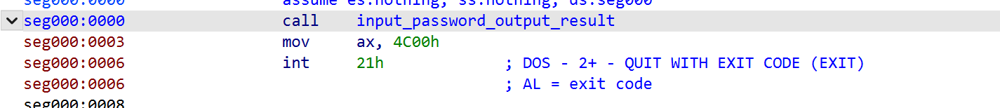

Сначала у пользователя запрашивается пароль и вводится в буфер.

Затем высчитывается хэш введенного пароля.

Затем проверяется то, что канарейка, расположенная после буфера, в сохранности ( если не в сохранности, то сразу выводится, что пароль неверный).

Затем проверяется хэш введенного пароля и эталонным и в зависимости от этого выводится либо что пароль верный, либо что пароль неверный:


Функция подсчета хэша:

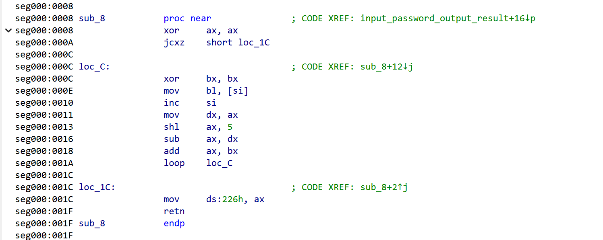

Подготовка к выводу сообщения о том, что пароль верный/неверный, вызов функции отрисовки рамки и завершение программы:

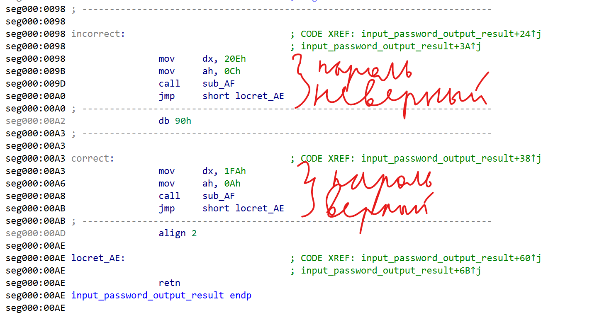

Функция вывода рамки:

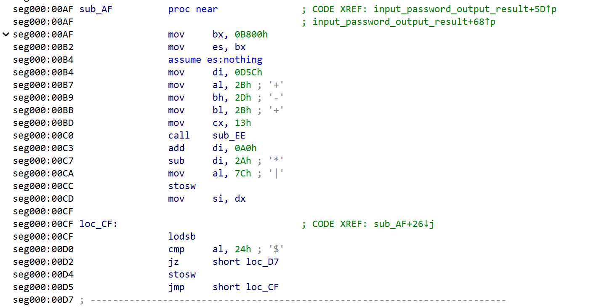
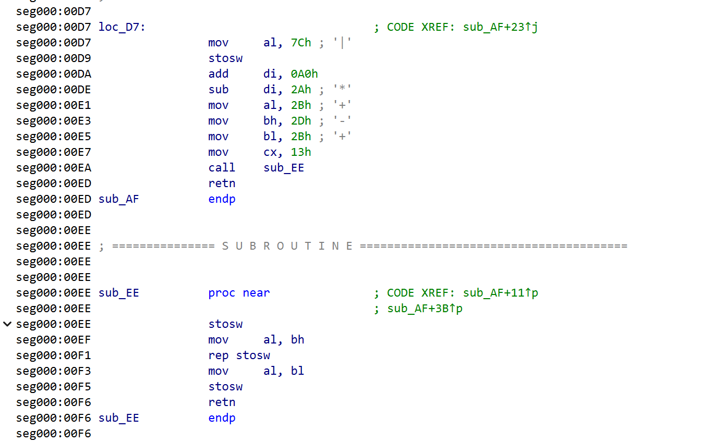

Граф программы 1


#### Уязвимость 1. Переполнение буфера
**Логика поиска уязвимости**

Рассмотрим фрагмент кода, где у пользователя запрашивается символ, и кладется в буфер:

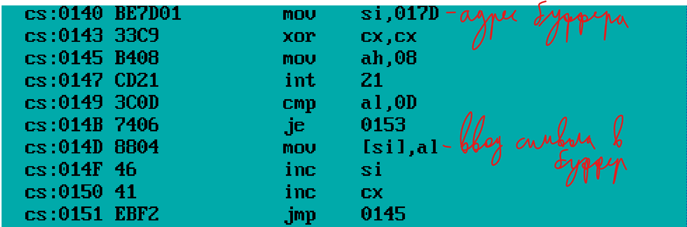

Видим, что адрес буфера cs:017D, и также видим что его размер 25 байт. Найдем данный буфер в коде и посмотрим на код под ним и над ним:

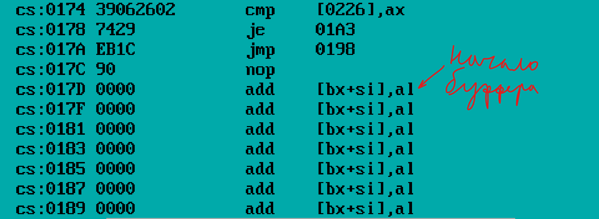

Так как turbo debugger плохо дизассемблировал код после буфера, посмотрим тот же код в IDA:

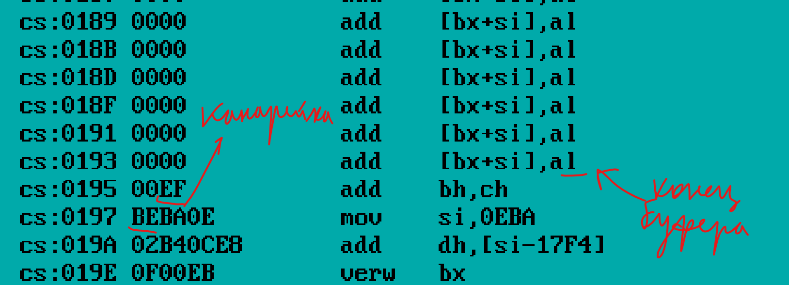

Расположение данных в памяти в этом месте следующее:
- буфер для ввода пароля
- канарейка (EFBE)
- код, который подготавливает вывод сообщения о неверном пароле
- код, который подготавливает вывод сообщения о верном пароле

Сразу после буфера, в который записывается пароль, в памяти находятся инструкции, связанные с выводом результата проверки.

Начнем переполнять буфер следующим образом:

1. Сначала заполним буфер (25 байт) любыми данными
2. Далее запишем значение канарейки
3. И потом запишем следующие байты  BA FA 01 B4 0A , они кодируют инструкции:

```assembly
mov dx, 20Eh
mov ah, 0Ch
```
которые отвечают за подготовку данных для вывода в рамке, что пароль верный.

Они заменят байты BA 0E 02 B4 0C, которые кодируют инструкции:

```assembly
mov dx, 1FAh
mov ah, 0Ah
```

В итоге пользователю выведется сообщение, что пароль верный

Код, формирующий последовательность байт для эксплуатации данной уязвимости, приведён в файле VZ1.CPP в папке CR_PROG.

## Программа 2. Обзор

Вызывается основная функция выполнения программы, а затем программа завершается:

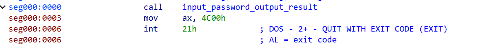

Сначала у пользователя запрашивается пароль и вводится в стек, причем каждый следующий байт вводится по более высокому адресу, чем предыдущий.

Затем проверяется, что длина пароля не больше некоторого значения.

Затем высчитывается хэш введенного пароля.

Затем проверяется то, что канарейка, расположенная до данных, в сохранности ( если не в сохранности, то сразу выводится, что пароль неверный).

Затем проверяется хэш введенного пароля и эталонным и в зависимости от этого выводится либо что пароль верный, либо что пароль неверный:

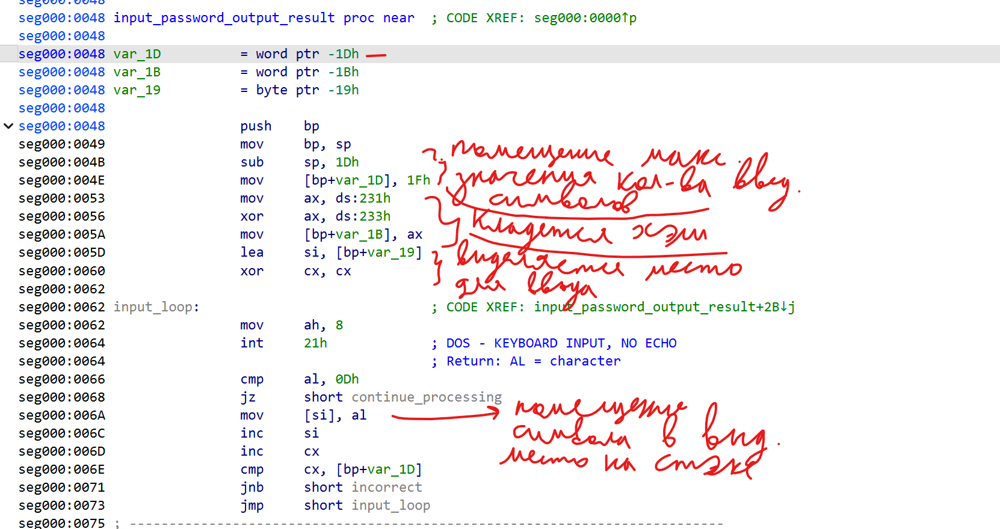

Далее я нашла код, с помощью которого подготавливаются данные для вывода того, что пароль верный/неверный, вызывается функция вывода данной информации на экран и реализуется возврат в main с восстановлением bp:

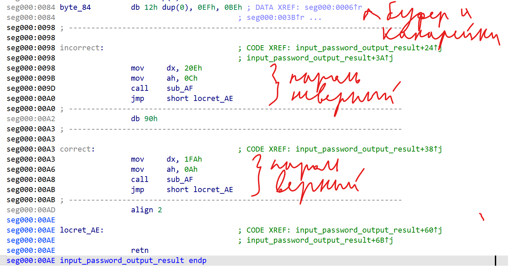

Вывод рамки:

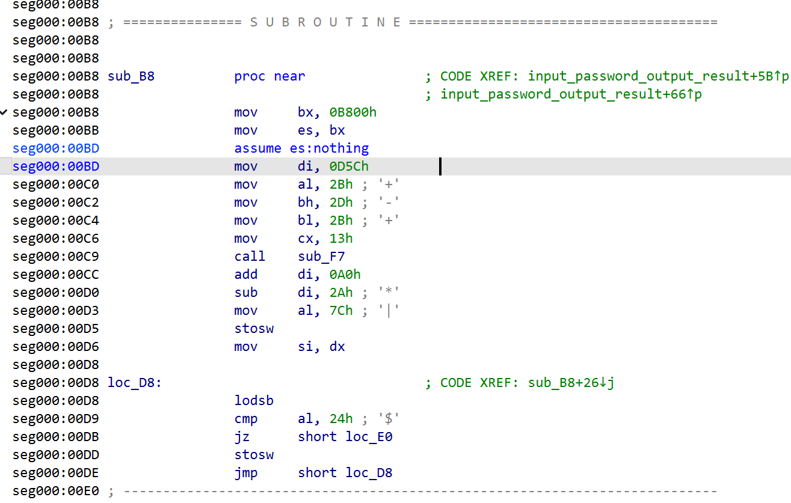

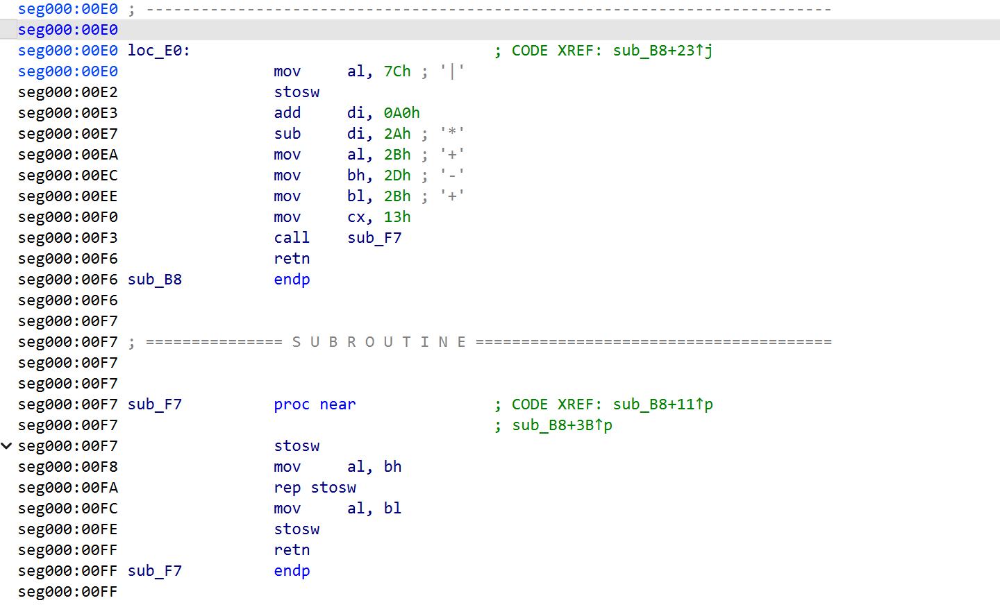

Граф программы:


## Уязвимость 2. Переполнение стека и замена адреса возврата
Вводимые данные также помещаются в стек. При этом каждый следующий байт записывается по адресу, который больше предыдущего.

В программе присутствует проверка количества введенных символов, однако Максимально допустимый размер данных, с которым сравнивается счетчик введенных символов, выбран таким образом, что проверка фактически не ограничивает ввод. 

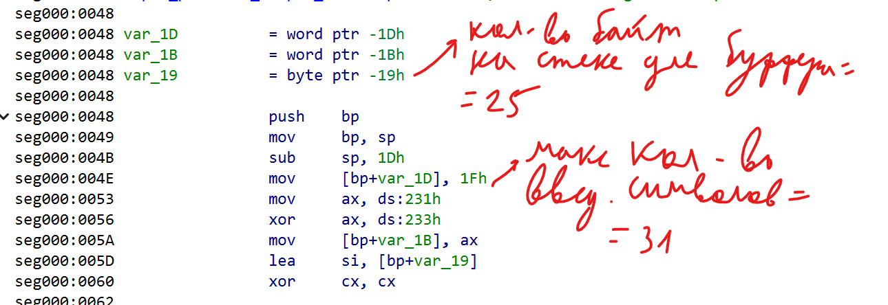

В стек также записывается канарейка, но она расположена ниже области, куда попадают вводимые данные, поэтому при переполнении она не изменяется.

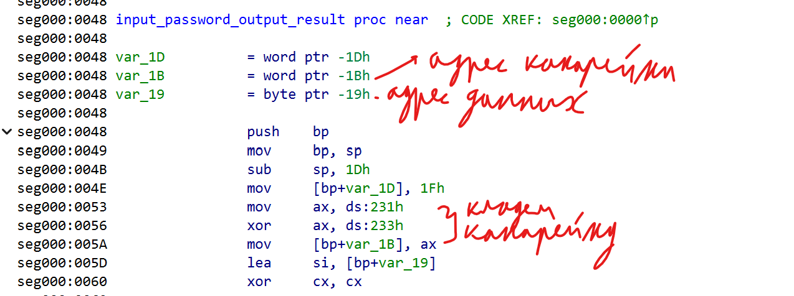

Благодаря этому появляется возможность дойти до области стека, где расположен адрес возврата из функции, и изменить его. В качестве нового адреса можно указать участок кода, который выводит сообщение о том, что пароль верный.

### Сложности взлома

Ввод пароля, вычисление хэша и подготовка данных для вывода выполняются в одной функции. Возврат из нее происходит только для завершения программы. 

Поэтому в стек нужно записать адрес кода, который выводит сообщение о правильном пароле и адрес кода завершения программы.

Кроме того, перед выходом из функции происходит восстановление регистра sp через значение bp:


При первом возврате (когда управление передается на код, выводящий сообщение о том, что пароль верный) значение SP восстанавливается корректно.

Однако проблемы возникают при следующем возврате из функции.


Чтобы программа успешно завершилась после второго возврата, нужно подменить стек таким образом, чтобы цепочка вызовов привела к нужному результату. Сначала в стек кладется значение регистра bp (Важно правильно рассчитать его смещение, так как команда `pop bp` впоследствии сдвинет вершину стека (sp) на 2 байта). После этого записывается адрес кода, который выводит сообщение о правильном пароле, а затем — адрес возврата, ведущий к завершению программы.

Код, формирующий последовательность байт для эксплуатации данной уязвимости, приведён в файле VZ2.CPP в папке CR_PROG.

## Патчинг

В ходе исследования уязвимостей программы возник вопрос: можно ли изменить её поведение без эксплуатации переполнения буфера. Например, добиться того, чтобы при вводе любого пароля (который не вызывает переполнение) программа всё равно выводила сообщение о корректном пароле.

Это можно сделать, изменив инструкции непосредственно в .com-файле. Рассмотрим программу 1.

В коде программы есть участок, где происходит сравнение вычисленного хэша с эталонным:

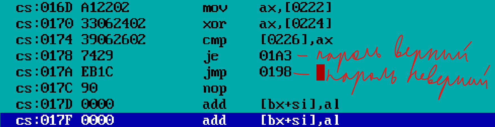

Чтобы программа переходила к ветке «пароль верный» независимо от результата сравнения, можно заменить условный переход (`je 01BC`) на безусловный (`jmp 01BC`).

Инструкция `je` кодируется байтом `74`, а `jmp` - `EB`. Так что нам достаточно заменить байт `74` по адресу `cs:0178` на байт `EB`.

Код, производящий замену байт для успешного патчинга, приведён в файле PATCH.CPP в папке CR_PROG.